# Software Requirements Document (SRD)
## AMS Bypass Web Query Application v1.0.0

---

## 1. Project Overview

### 1.1 Project Name
AMS Bypass Web Query Application

### 1.2 Project Purpose
PostgreSQL 데이터베이스의 `tenant.ams_bypass` 테이블을 조회하기 위한 웹 기반 쿼리 애플리케이션 개발

### 1.3 Project Scope
- Python 기반 웹 애플리케이션 개발
- PostgreSQL 데이터베이스 조회 기능 제공
- JSON 데이터 파싱 및 테이블 형태 표시
- 검색 조건 기반 필터링 기능
- 실시간 데이터 업데이트 기능 (RealTime 모드)
- 페이징 기능 (100개 행씩)

### 1.4 전체 시스템 개요

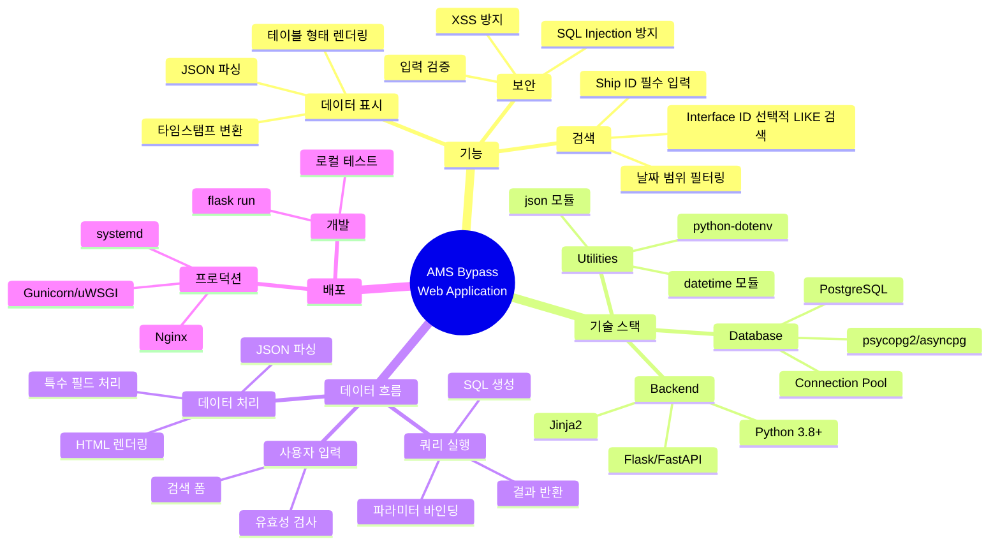

### 1.5 System Architecture

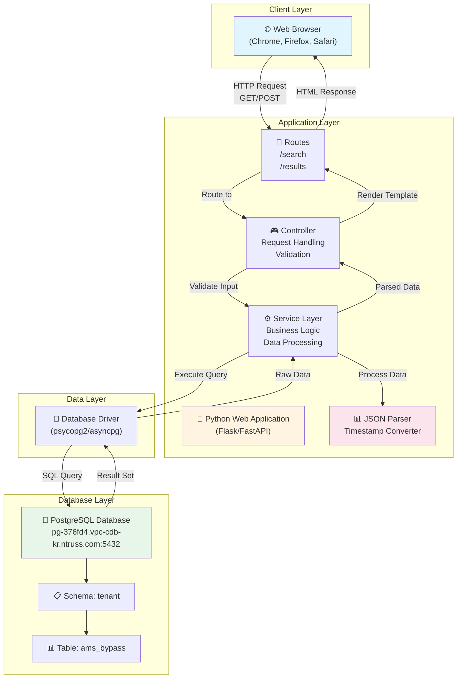

---

## 2. Functional Requirements

### 2.1 검색 기능

#### 2.1.1 필수 검색 조건
- **ship_id**: 필수 입력 항목
  - 사용자가 반드시 입력해야 함
  - 빈 값일 경우 검색 불가 (유효성 검사 필요)

#### 2.1.2 선택적 검색 조건

**interface_id**:
- 선택적 입력 항목
- 부분 일치 검색 지원 (양쪽 LIKE 패턴 적용)
- 예: "ECS" 입력 시 "%ECS%"로 검색하여 "bypass_ECS01_DI" 등과 매칭

**날짜 범위**:
- **from_date** (시작일): 선택적 입력
- **to_date** (종료일): 선택적 입력
- `created_time` 컬럼 기준으로 범위 필터링
- 단일 날짜 입력 시 해당 일자의 데이터만 조회
- 두 날짜 모두 입력 시 범위 내 데이터 조회

### 2.2 데이터 표시 기능

#### 2.2.1 JSON 데이터 파싱
- `json_data` 컬럼의 텍스트 형태 JSON을 파싱
- 파싱된 데이터를 테이블 형태로 표시

#### 2.2.2 테이블 표시 형식

**컬럼 구성**:
- Ship ID
- TagName (기존 Key에서 변경)
- Value
- Description
- Unit
- CreatedTime (기존 $ship_posixmicros에서 변경)

**Interface ID 제거**: 테이블에서 Interface ID 컬럼은 표시하지 않음

**페이징**: 100개 행씩 페이징 처리

#### 2.2.3 사용자 인터랙션 플로우

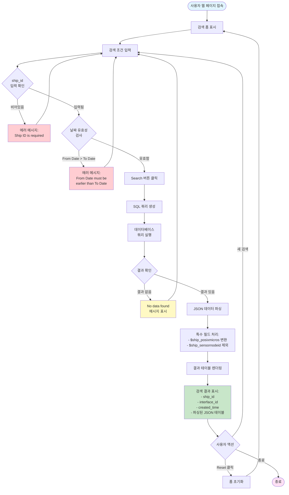

#### 2.2.3 데이터 필드 표시 규칙

**표시할 필드**:
- 각 JSON 키-값 쌍을 테이블 행으로 표시
- 각 객체의 다음 속성 표시:
  - **Key**: JSON 키 이름 (예: "Gas", "SV40", "SV88" 등)
  - **Description**: `desc` 속성 값
  - **Unit**: `unit` 속성 값
  - **Value**: `value` 속성 값 (boolean, number, string 등)

**특수 처리**:
- **$ship_posixmicros**: 
  - Unix timestamp (마이크로초 단위)를 사람이 읽기 쉬운 날짜/시간 형식으로 변환하여 표시
  - 예: "2025-10-31 14:32:27.183773" 형식 또는 유사한 형식
- **$ship_sensornodeid**: 
  - 표시하지 않음 (무시)

**기본 정보 표시**:
- 검색 결과 목록의 각 레코드에 대해 다음 정보 표시:
  - ship_id
  - interface_id (있는 경우)
  - created_time (사용자가 입력한 날짜 범위와는 별개로 실제 저장된 시간)
  - 파싱된 JSON 데이터 테이블

---

## 3. Technical Requirements

### 3.1 기술 스택
- **프로그래밍 언어**: Python 3.x
- **웹 프레임워크**: Flask 또는 FastAPI 권장
- **데이터베이스 드라이버**: psycopg2 또는 asyncpg
- **템플릿 엔진**: Jinja2 (Flask 사용 시) 또는 HTML 템플릿
- **JSON 파싱**: Python 내장 json 모듈

#### 3.1.1 컴포넌트 구조 다이어그램

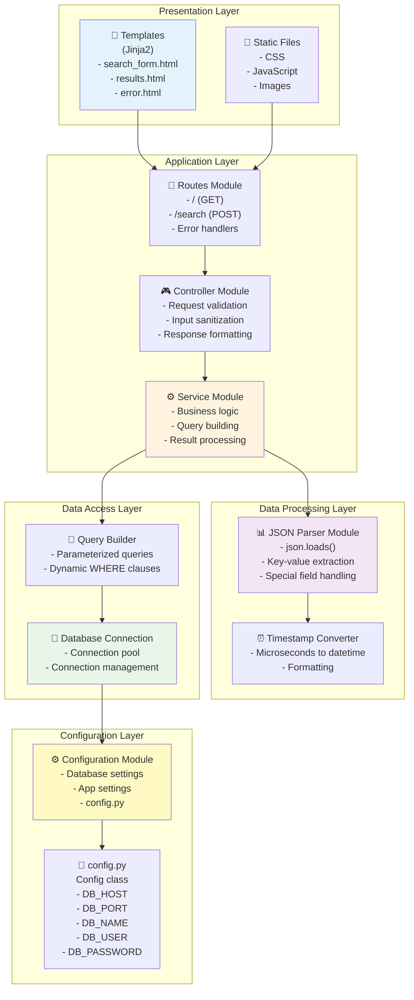

#### 3.1.2 데이터 플로우 다이어그램

```mermaid
flowchart LR
    subgraph "1. Input Data"
        UserInput["사용자 입력:<br/>ship_id: 'SHIP001'<br/>interface_id: 'ECS'<br/>from_date: '2025-01-01'<br/>to_date: '2025-01-31'"]
    end
    
    subgraph "2. Query Building"
        QueryBuild["SQL 쿼리 생성:<br/>WHERE ship_id = 'SHIP001'<br/>AND interface_id LIKE '%ECS%'<br/>AND created_time >= '2025-01-01'<br/>AND created_time <= '2025-01-31'"]
    end
    
    subgraph "3. Database"
        DBData["DB 결과:<br/>[{<br/>  id: 1,<br/>  ship_id: 'SHIP001',<br/>  interface_id: 'bypass_ECS01_DI',<br/>  json_data: '{...}',<br/>  created_time: '2025-01-15 10:30:00'<br/>}, ...]"]
    end
    
    subgraph "4. JSON Parsing"
        ParsedData["파싱된 데이터:<br/>[{<br/>  key: 'Gas',<br/>  desc: 'Fuel mode...',<br/>  unit: '',<br/>  value: false<br/>}, ...]"]
    end
    
    subgraph "5. Timestamp Conversion"
        ConvertedData["변환된 타임스탬프:<br/>$ship_posixmicros:<br/>1761798747183773 →<br/>2025-10-31 14:32:27.183773"]
    end
    
    subgraph "6. HTML Rendering"
        HTMLOutput["HTML 테이블:<br/>&lt;table&gt;<br/>  &lt;thead&gt;...&lt;/thead&gt;<br/>  &lt;tbody&gt;<br/>    &lt;tr&gt;...&lt;/tr&gt;<br/>  &lt;/tbody&gt;<br/>&lt;/table&gt;"]
    end
    
    UserInput -->|1. 입력| QueryBuild
    QueryBuild -->|2. 실행| DBData
    DBData -->|3. 추출| ParsedData
    ParsedData -->|4. 변환| ConvertedData
    ConvertedData -->|5. 렌더링| HTMLOutput
    
    style UserInput fill:#e1f5ff
    style QueryBuild fill:#fff9c4
    style DBData fill:#e8f5e9
    style ParsedData fill:#f3e5f5
    style ConvertedData fill:#fff3e0
    style HTMLOutput fill:#e3f2fd
```

### 3.2 데이터베이스 연결 정보

| 항목 | 값 |
|------|-----|
| **Host** | pg-376fd4.vpc-cdb-kr.ntruss.com |
| **Port** | 5432 |
| **Database** | tenant_builder |
| **Schema** | tenant |
| **Username** | bypass |
| **Password** | qkdlvotm12!@ |
| **JDBC URL** | jdbc:postgresql://pg-376fd4.vpc-cdb-kr.ntruss.com:5432/tenant_builder |

### 3.3 데이터베이스 스키마

#### 3.3.1 테이블: tenant.ams_bypass

| 컬럼명 | 타입 | 제약조건 | 설명 |
|--------|------|----------|------|
| id | bigserial | PRIMARY KEY | 자동 증가 ID |
| ship_id | text | NOT NULL | 선박 ID (필수) |
| interface_id | text | NULLABLE | 인터페이스 ID (선택) |
| json_data | text | NULLABLE | JSON 데이터 (텍스트 형태) |
| created_time | timestamp | NOT NULL | 생성 시간 (필수) |
| server_created_time | timestamp | NULLABLE | 서버 생성 시간 (선택) |

**제약조건**:
- PRIMARY KEY: `id` (ams_bypass_pkey)
- UNIQUE: `(ship_id, interface_id, created_time)` (ams_bypass_uq)

**테이블 설정**:
- autovacuum_vacuum_scale_factor: 0.0
- autovacuum_vacuum_threshold: 100000

#### 3.3.2 데이터베이스 ERD

```mermaid
erDiagram
    TENANT_AMS_BYPASS {
        bigserial id PK "PRIMARY KEY<br/>auto increment"
        text ship_id "NOT NULL<br/>선박 ID (필수)"
        text interface_id "NULLABLE<br/>인터페이스 ID (선택)"
        text json_data "NULLABLE<br/>JSON 텍스트 데이터"
        timestamp created_time "NOT NULL<br/>생성 시간 (필수)"
        timestamp server_created_time "NULLABLE<br/>서버 생성 시간"
    }
    
    TENANT_AMS_BYPASS ||--o{ JSON_OBJECT : contains "1:N 파싱 관계"
    
    JSON_OBJECT {
        string key "JSON 키 이름"
        string desc "설명"
        string unit "단위"
        any value "값 (boolean/number/string)"
    }
    
    JSON_OBJECT ||--o| TIMESTAMP_OBJECT : "특수 처리"
    
    TIMESTAMP_OBJECT {
        string key "$ship_posixmicros"
        bigint posix_micros "마이크로초 단위 Unix timestamp"
        datetime formatted_time "변환된 날짜/시간"
    }
    
    note right of TENANT_AMS_BYPASS
        UNIQUE CONSTRAINT:
        (ship_id, interface_id, created_time)
        
        AUTOVACUUM:
        scale_factor=0.0
        threshold=100000
    end note
    
    note right of JSON_OBJECT
        파싱 예시:
        {
          "Gas": {
            "desc": "Fuel mode active: Gas mode",
            "unit": "",
            "value": false
          },
          "$ship_posixmicros": 1761798747183773
        }
    end note
```

#### 3.3.3 기술 스택 다이어그램

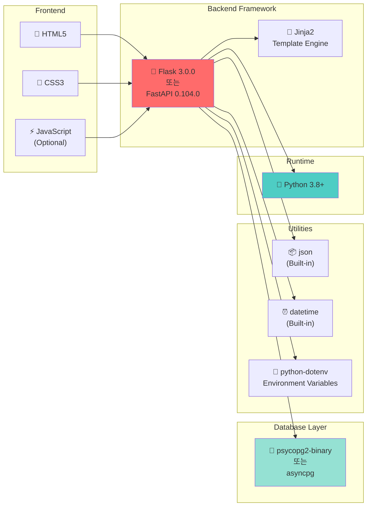

---

## 4. User Interface Requirements

### 4.1 검색 폼 (Search Form)

**입력 필드 구성 (한 줄 배치)**:
```
[Ship ID *] [Interface ID] [From Date] [To Date] [Search] [Reset] [RealTime]
```

**필드 상세**:
- **Ship ID**: 텍스트 입력 필드 (필수, * 표시)
- **Interface ID**: 텍스트 입력 필드 (선택)
- **From Date**: 날짜 선택 필드 (선택, YYYY-MM-DD 형식, 기본값: 오늘 날짜)
- **To Date**: 날짜 선택 필드 (선택, YYYY-MM-DD 형식, 기본값: 오늘 날짜)
- **Search 버튼**: 검색 실행
- **Reset 버튼**: 폼 초기화 (날짜는 오늘 날짜로 초기화)
- **RealTime 버튼**: 실시간 모드 토글 (ON/OFF)

#### 4.1.1 UI 레이아웃 다이어그램

```mermaid
graph TB
    subgraph "Page Container"
        Header["📋 Header<br/>AMS Bypass Query Application"]
        
        subgraph "Search Form Section"
            FormTitle["🔍 Search Criteria"]
            ShipID["Ship ID *<br/>[Text Input]"]
            InterfaceID["Interface ID<br/>[Text Input - Optional]"]
            FromDate["From Date<br/>[Date Picker - Optional]"]
            ToDate["To Date<br/>[Date Picker - Optional]"]
            Buttons["[Search Button] [Reset Button]"]
        end
        
        subgraph "Results Section"
            ResultTitle["📊 Search Results"]
            ResultCount["Total: N records"]
            
            subgraph "Record 1"
                Record1Header["▶️ Record #1<br/>Ship ID: ABC123<br/>Interface ID: bypass_ECS01_DI<br/>Created: 2025-01-27 10:30:00"]
                Record1Table["┌──────────┬───────────────────────────────────────┬──────┬───────┐<br/>│ Key      │ Description                          │ Unit │ Value │<br/>├──────────┼───────────────────────────────────────┼──────┼───────┤<br/>│ Gas      │ Fuel mode active: Gas mode            │      │ false │<br/>│ SV40     │ SV40 DO Starting air valve            │      │ false │<br/>│ SV88     │ SV88-A DO Main Degassing valve...     │      │ true  │<br/>│ ...      │ ...                                   │ ...  │ ...   │<br/>│ $ship... │ Timestamp                             │      │ 2025-10-31 14:32:27 │<br/>└──────────┴───────────────────────────────────────┴──────┴───────┘"]
            end
            
            subgraph "Record 2"
                Record2Header["▶️ Record #2<br/>..."]
            end
            
            Pagination["[< Previous] [1] [2] [3] [Next >]"]
        end
        
        Footer["📝 Footer<br/>Version 1.0.0"]
    end
    
    Header --> FormTitle
    FormTitle --> ShipID
    ShipID --> InterfaceID
    InterfaceID --> FromDate
    FromDate --> ToDate
    ToDate --> Buttons
    Buttons --> ResultTitle
    ResultTitle --> ResultCount
    ResultCount --> Record1Header
    Record1Header --> Record1Table
    Record1Table --> Record2Header
    Record2Header --> Pagination
    Pagination --> Footer
    
    style Header fill:#e3f2fd
    style FormTitle fill:#fff3e0
    style ResultTitle fill:#f3e5f5
    style Record1Table fill:#e8f5e9
```

### 4.2 검색 결과 표시

#### 4.2.1 결과 목록 영역
- 검색 결과가 여러 건일 경우 목록 형태로 표시
- 각 레코드별로 접기/펼치기 가능한 형태 권장

#### 4.2.2 JSON 데이터 테이블
각 레코드의 `json_data`를 파싱하여 다음 형식의 테이블로 표시:

| Ship ID | TagName | Value | Description | Unit | CreatedTime |
|---------|---------|-------|-------------|------|-------------|
| SHIP001 | Gas | false | Fuel mode active: Gas mode | | 2025-10-31 14:32:27 |
| SHIP001 | SV40 | false | SV40 DO Starting air valve | | 2025-10-31 14:32:27 |
| SHIP001 | SV88 | true | SV88-A DO Main Degassing... | | 2025-10-31 14:32:27 |
| ... | ... | ... | ... | ... | ... |

**표시 형식 요구사항**:
- 엑셀 스타일 테이블로 표시
- 헤더 행: Ship ID, TagName, Value, Description, Unit, CreatedTime
- 데이터 행: 각 레코드의 JSON 키-값 쌍을 개별 행으로 표시
- 페이징: 100개 행씩 표시
- 최신순 정렬

#### 4.2.3 요청-응답 시퀀스 다이어그램

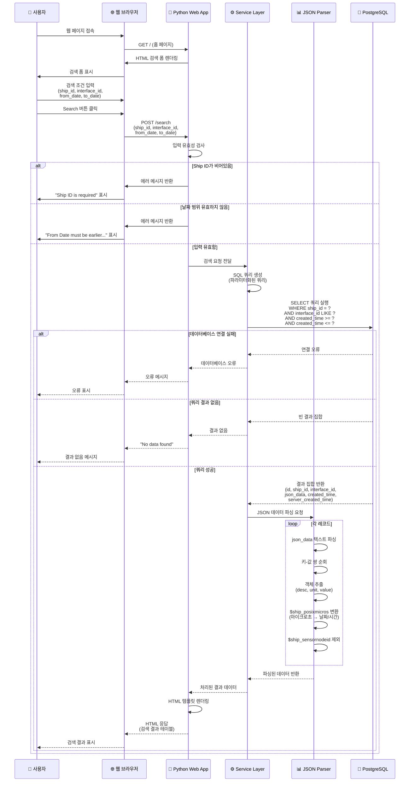

### 4.3 에러 및 메시지 처리

**유효성 검사**:
- Ship ID가 비어있을 경우: "Ship ID is required" 메시지 표시
- 날짜 형식이 잘못된 경우: "Invalid date format" 메시지 표시
- From Date가 To Date보다 큰 경우: "From Date must be earlier than To Date" 메시지 표시

**데이터 검색 결과**:
- 검색 결과가 없을 경우: "No data found" 메시지 표시
- 데이터베이스 연결 오류: 적절한 오류 메시지 표시

---

## 5. SQL Query Requirements

### 5.1 기본 쿼리 구조

```sql
SELECT 
    id,
    ship_id,
    interface_id,
    json_data,
    created_time,
    server_created_time
FROM tenant.ams_bypass
WHERE 
    ship_id = :ship_id
    [AND interface_id LIKE '%' || :interface_id || '%']
    [AND created_time >= :from_date]
    [AND created_time <= :to_date]
ORDER BY created_time DESC;
```

### 5.2 쿼리 조건 로직

**필수 조건**:
- `ship_id = :ship_id` (정확한 일치)

**선택적 조건**:
- `interface_id`가 제공된 경우: `interface_id LIKE '%' || :interface_id || '%'`
- `from_date`가 제공된 경우: `created_time >= :from_date`
- `to_date`가 제공된 경우: `created_time <= :to_date + INTERVAL '1 day' - INTERVAL '1 second'` (해당 일자 종료 시각까지 포함)

#### 5.2.1 SQL 쿼리 빌딩 로직

```mermaid
flowchart TD
    Start([사용자 입력:<br/>ship_id, interface_id,<br/>from_date, to_date]) --> BaseQuery[기본 쿼리 시작:<br/>SELECT id, ship_id, interface_id,<br/>json_data, created_time,<br/>server_created_time<br/>FROM tenant.ams_bypass<br/>WHERE]
    
    BaseQuery --> AddShipID[필수 조건 추가:<br/>ship_id = :ship_id]
    
    AddShipID --> CheckInterfaceID{interface_id<br/>제공됨?}
    
    CheckInterfaceID -->|예| AddInterfaceID[조건 추가:<br/>AND interface_id LIKE<br/>'%' || :interface_id || '%']
    CheckInterfaceID -->|아니오| CheckFromDate
    
    AddInterfaceID --> CheckFromDate{from_date<br/>제공됨?}
    
    CheckFromDate -->|예| AddFromDate[조건 추가:<br/>AND created_time >= :from_date<br/>00:00:00]
    CheckFromDate -->|아니오| CheckToDate
    
    AddFromDate --> CheckToDate{to_date<br/>제공됨?}
    
    CheckToDate -->|예| AddToDate[조건 추가:<br/>AND created_time <= :to_date<br/>23:59:59.999999]
    CheckToDate -->|아니오| AddOrderBy
    
    AddToDate --> AddOrderBy[정렬 추가:<br/>ORDER BY created_time DESC]
    
    AddOrderBy --> ExecuteQuery[파라미터화된 쿼리 실행<br/>SQL Injection 방지]
    
    ExecuteQuery --> ReturnResults[결과 반환]
    
    ReturnResults --> End([종료])
    
    style Start fill:#e1f5ff
    style End fill:#ffe1f5
    style AddShipID fill:#fff9c4
    style ExecuteQuery fill:#c8e6c9
```

#### 5.2.2 쿼리 조건 조합 예시

```mermaid
graph TB
    subgraph "예시 1: 최소 조건"
        E1Input["입력:<br/>ship_id = 'SHIP001'"]
        E1Query["쿼리:<br/>WHERE ship_id = 'SHIP001'<br/>ORDER BY created_time DESC"]
    end
    
    subgraph "예시 2: interface_id 포함"
        E2Input["입력:<br/>ship_id = 'SHIP001'<br/>interface_id = 'ECS'"]
        E2Query["쿼리:<br/>WHERE ship_id = 'SHIP001'<br/>AND interface_id LIKE '%ECS%'<br/>ORDER BY created_time DESC"]
    end
    
    subgraph "예시 3: 날짜 범위 포함"
        E3Input["입력:<br/>ship_id = 'SHIP001'<br/>from_date = '2025-01-01'<br/>to_date = '2025-01-31'"]
        E3Query["쿼리:<br/>WHERE ship_id = 'SHIP001'<br/>AND created_time >= '2025-01-01 00:00:00'<br/>AND created_time <= '2025-01-31 23:59:59'<br/>ORDER BY created_time DESC"]
    end
    
    subgraph "예시 4: 모든 조건"
        E4Input["입력:<br/>ship_id = 'SHIP001'<br/>interface_id = 'ECS'<br/>from_date = '2025-01-01'<br/>to_date = '2025-01-31'"]
        E4Query["쿼리:<br/>WHERE ship_id = 'SHIP001'<br/>AND interface_id LIKE '%ECS%'<br/>AND created_time >= '2025-01-01 00:00:00'<br/>AND created_time <= '2025-01-31 23:59:59'<br/>ORDER BY created_time DESC"]
    end
    
    E1Input --> E1Query
    E2Input --> E2Query
    E3Input --> E3Query
    E4Input --> E4Query
    
    style E1Input fill:#e3f2fd
    style E2Input fill:#e3f2fd
    style E3Input fill:#e3f2fd
    style E4Input fill:#e3f2fd
    style E1Query fill:#e8f5e9
    style E2Query fill:#e8f5e9
    style E3Query fill:#e8f5e9
    style E4Query fill:#e8f5e9
```

---

## 6. Data Processing Requirements

### 6.1 JSON 파싱 로직

**파싱 단계**:
1. `json_data` 텍스트를 JSON 객체로 파싱
2. 각 키-값 쌍을 순회
3. 값이 객체인 경우 (`desc`, `unit`, `value` 속성 포함):
   - Key, Description, Unit, Value 추출
4. 특수 키 처리:
   - `$ship_posixmicros`: 마이크로초 단위 Unix timestamp를 읽기 쉬운 날짜 형식으로 변환
   - `$ship_sensornodeid`: 건너뛰기

#### 6.1.1 JSON 파싱 플로우 다이어그램

```mermaid
flowchart TD
    Start([JSON 텍스트 데이터<br/>json_data 컬럼]) --> ParseJSON[Python json.loads<br/>JSON 파싱]
    
    ParseJSON --> CheckValid{파싱<br/>성공?}
    
    CheckValid -->|실패| ErrorJSON[에러 처리:<br/>Invalid JSON format]
    ErrorJSON --> End([종료])
    
    CheckValid -->|성공| GetKeys[모든 키 추출<br/>keys = json_obj.keys()]
    
    GetKeys --> IterateKeys[키-값 쌍 순회<br/>for key, value in items]
    
    IterateKeys --> CheckSpecialKey{특수 키<br/>확인}
    
    CheckSpecialKey -->|$ship_sensornodeid| SkipNodeID[건너뛰기<br/>continue]
    SkipNodeID --> NextKey{다음 키<br/>있음?}
    
    CheckSpecialKey -->|$ship_posixmicros| ExtractMicros[마이크로초 값 추출<br/>posix_micros = value]
    ExtractMicros --> ConvertTimestamp[타임스탬프 변환<br/>timestamp_seconds = posix_micros / 1000000<br/>dt = datetime.fromtimestamp<br/>formatted = dt.strftime]
    ConvertTimestamp --> AddToTable[테이블 행 추가:<br/>Key: $ship_posixmicros<br/>Description: -<br/>Unit: -<br/>Value: formatted datetime]
    AddToTable --> NextKey
    
    CheckSpecialKey -->|일반 키| CheckValueType{값 타입<br/>확인}
    
    CheckValueType -->|객체 dict| CheckDictKeys{dict에<br/>desc/unit/value<br/>속성 존재?}
    
    CheckDictKeys -->|예| ExtractFields[필드 추출:<br/>desc = value.get'desc'<br/>unit = value.get'unit'<br/>val = value.get'value']
    ExtractFields --> AddObjectRow[테이블 행 추가:<br/>Key: key<br/>Description: desc<br/>Unit: unit<br/>Value: val]
    AddObjectRow --> NextKey
    
    CheckDictKeys -->|아니오| HandleInvalid[잘못된 형식 처리:<br/>기본값 사용 또는<br/>에러 로깅]
    HandleInvalid --> NextKey
    
    CheckValueType -->|원시값<br/>string/number/bool| AddPrimitiveRow[테이블 행 추가:<br/>Key: key<br/>Description: -<br/>Unit: -<br/>Value: value]
    AddPrimitiveRow --> NextKey
    
    NextKey -->|있음| IterateKeys
    NextKey -->|없음| SortTable[테이블 정렬<br/>특수 키는 하단에]
    
    SortTable --> GenerateHTML[HTML 테이블 생성<br/>thead + tbody]
    
    GenerateHTML --> ReturnResult[파싱된 결과 반환:<br/>- 테이블 HTML<br/>- 행 데이터 배열]
    
    ReturnResult --> End
    
    style Start fill:#e1f5ff
    style End fill:#ffe1f5
    style ErrorJSON fill:#ffcdd2
    style ConvertTimestamp fill:#fff9c4
    style GenerateHTML fill:#c8e6c9
```

#### 6.1.2 JSON 데이터 구조 예시 및 파싱 결과

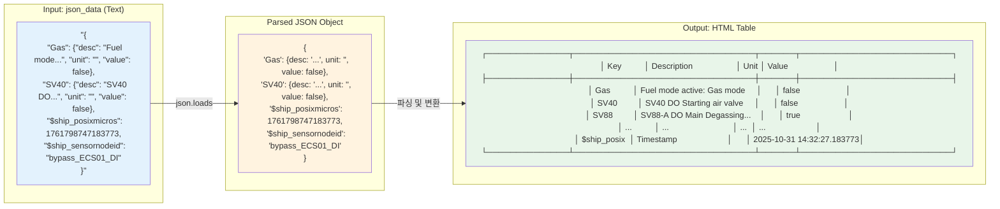

### 6.2 타임스탬프 변환

**$ship_posixmicros 변환**:
- 입력: 1761798747183773 (마이크로초 단위 Unix timestamp)
- 변환: Python `datetime` 모듈 사용
- 출력 형식 예: "2025-10-31 14:32:27.183773" 또는 "2025-10-31 14:32:27"

**변환 공식**:
```python
from datetime import datetime
timestamp_seconds = posix_micros / 1_000_000
dt = datetime.fromtimestamp(timestamp_seconds)
formatted = dt.strftime('%Y-%m-%d %H:%M:%S.%f')
```

#### 6.2.1 타임스탬프 변환 플로우

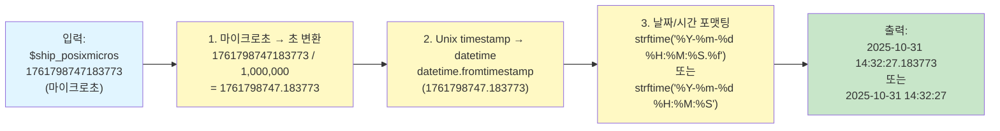

#### 6.2.2 타임스탬프 변환 예시

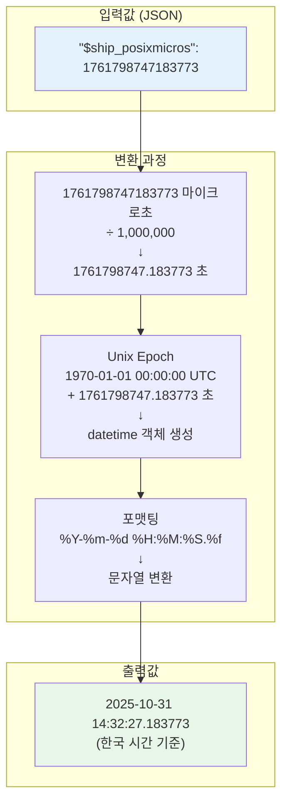

---

## 7. Security Requirements

### 7.1 데이터베이스 연결 보안
- 데이터베이스 자격 증명을 `config.py` 파일에서 관리
- 연결 문자열에 직접 하드코딩하지 않음 (프로덕션 환경에서는 환경 변수 사용 권장)
- SQL Injection 방지를 위한 파라미터화된 쿼리 사용

### 7.2 입력 검증
- 사용자 입력값에 대한 유효성 검사 수행
- SQL Injection 방지
- XSS(Cross-Site Scripting) 방지

#### 7.2.1 보안 처리 플로우

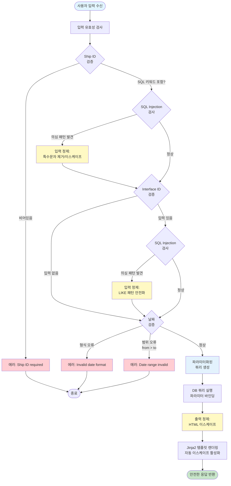

#### 7.2.2 SQL Injection 방지 메커니즘

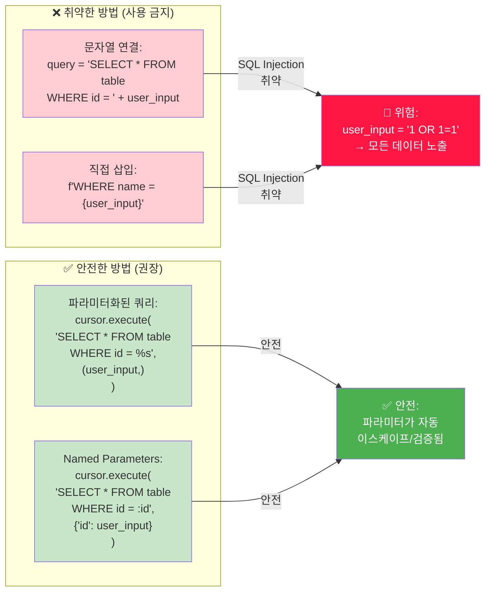

---

## 8. Performance Requirements

### 8.1 응답 시간
- 검색 결과 표시: 5초 이내 (일반적인 데이터 양 기준)
- 페이지 로딩: 2초 이내

### 8.2 데이터 처리
- JSON 파싱: 효율적인 파싱 알고리즘 사용
- 대용량 데이터 처리: 페이지네이션 또는 제한된 결과 수 표시 고려

---

## 9. Development Environment

### 9.1 필수 패키지

```
Flask==3.0.0
psycopg2-binary==2.9.11
```

### 9.2 개발 도구
- Python 3.8 이상
- 웹 브라우저 (Chrome, Firefox, Safari 등)

---

## 10. Testing Requirements

### 10.1 기능 테스트
- 필수 검색 조건 검증
- 선택적 검색 조건 동작 확인
- JSON 파싱 정확성 검증
- 날짜 범위 필터링 확인
- 에러 처리 확인

### 10.2 데이터 테스트
- 실제 데이터베이스 연결 테스트
- 다양한 JSON 구조에 대한 파싱 테스트
- 대용량 데이터 처리 테스트

#### 10.2.1 테스트 플로우 다이어그램

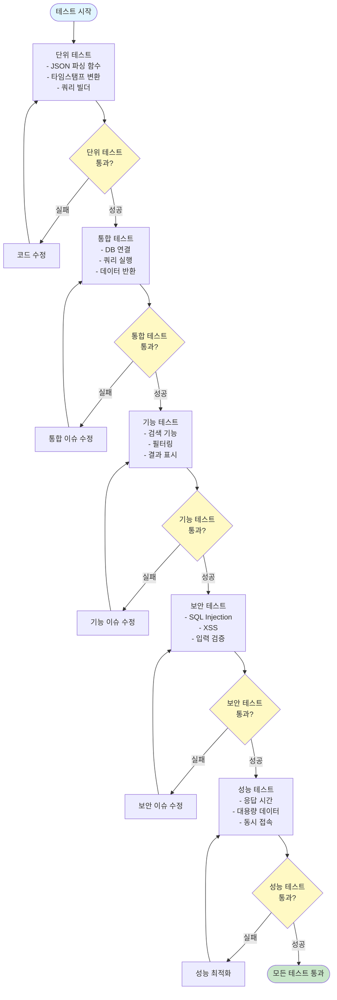

#### 10.2.2 테스트 케이스 매트릭스

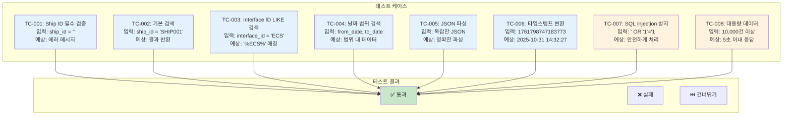

---

## 11. Deployment Requirements

### 11.1 데이터베이스 설정
- 데이터베이스 연결 정보를 `config.py` 파일에서 관리
- 프로덕션 환경에서는 보안을 위해 환경 변수 사용 권장

### 11.2 실행 방법
- 개발 환경: `python app.py` 또는 `flask run`
- 프로덕션 환경: Gunicorn 또는 uWSGI와 함께 배포

#### 11.2.1 배포 아키텍처 다이어그램

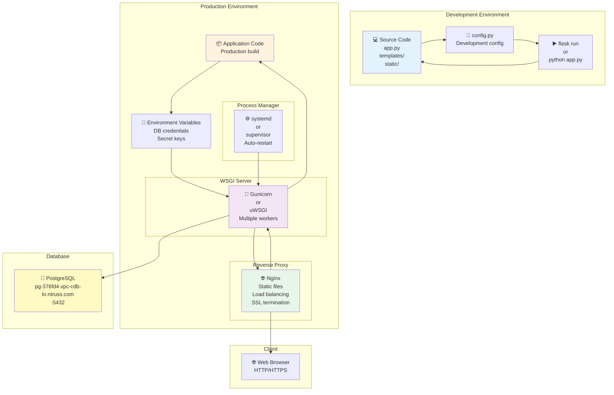

#### 11.2.2 배포 플로우

```mermaid
flowchart TD
    Start([개발 완료]) --> CreateConfig[설정 파일 확인<br/>config.py 설정]
    
    CreateConfig --> InstallDeps[의존성 설치<br/>pip install -r requirements.txt]
    
    InstallDeps --> TestLocal[로컬 테스트<br/>flask run]
    
    TestLocal --> TestPass{테스트<br/>통과?}
    
    TestPass -->|실패| FixIssues[이슈 수정]
    FixIssues --> TestLocal
    
    TestPass -->|성공| PrepareDeploy[배포 준비<br/>- 코드 최적화<br/>- 설정 파일 검증]
    
    PrepareDeploy --> ChooseServer{WSGI 서버<br/>선택}
    
    ChooseServer -->|Gunicorn| SetupGunicorn[Gunicorn 설정<br/>- workers 수<br/>- bind address<br/>- timeout]
    ChooseServer -->|uWSGI| SetupUwsgi[uWSGI 설정<br/>- processes<br/>- threads<br/>- socket]
    
    SetupGunicorn --> ConfigureNginx[Nginx 설정<br/>- reverse proxy<br/>- static files<br/>- SSL]
    SetupUwsgi --> ConfigureNginx
    
    ConfigureNginx --> SetupSystemd[systemd 서비스 설정<br/>자동 시작/재시작]
    
    SetupSystemd --> StartServices[서비스 시작<br/>systemctl start app.service]
    
    StartServices --> VerifyDeploy[배포 검증<br/>- 접근 테스트<br/>- 기능 테스트<br/>- 성능 확인]
    
    VerifyDeploy --> DeploySuccess{배포<br/>성공?}
    
    DeploySuccess -->|실패| Rollback[롤백<br/>이전 버전 복원]
    Rollback --> FixIssues
    
    DeploySuccess -->|성공| Monitor[모니터링<br/>- 로그 확인<br/>- 성능 추적<br/>- 오류 감시]
    
    Monitor --> End([배포 완료])
    
    style Start fill:#e1f5ff
    style End fill:#c8e6c9
    style TestPass fill:#fff9c4
    style DeploySuccess fill:#fff9c4
    style Rollback fill:#ffcdd2
```

---

## 12. Assumptions and Constraints

### 12.1 가정 사항
- 데이터베이스 서버는 접근 가능한 상태
- 네트워크 연결이 안정적
- 사용자는 웹 브라우저를 통해 접근

### 12.2 제약 사항
- 단순 조회 기능만 제공 (INSERT, UPDATE, DELETE 기능 없음)
- 사용자 인증/권한 관리 기능 없음 (추후 확장 가능)
- 단일 테이블 조회만 지원

---

## 13. Future Enhancements (Optional)

- 사용자 인증 및 권한 관리
- 검색 결과 내보내기 (CSV, Excel)
- 검색 조건 저장/불러오기
- 차트 및 그래프 시각화
- 정렬 기능 (컬럼별 정렬)
- 다국어 지원
- RealTime 폴링 간격 조절 옵션

---

---

## 14. RealTime 기능 요구사항

### 14.1 기능 개요

RealTime 버튼을 클릭하면 실시간으로 최신 데이터를 테이블에 추가하여 표시하는 기능입니다.

### 14.2 구현 방식

**Polling 방식 (구현됨)**:
- JavaScript가 5초 간격으로 AJAX 요청을 보내 최신 데이터를 가져옴
- 구현이 간단하고 Flask에 추가 라이브러리 불필요
- 서버 부하를 최소화하기 위해 적절한 간격 설정

### 14.3 사용자 인터페이스

**RealTime 버튼**:
- 위치: 검색 폼의 Search, Reset 버튼과 같은 줄
- 기본 상태: "⏸️ RealTime" (회색)
- 활성화 상태: "▶️ RealTime ON" (녹색)
- 클릭 시 토글 방식으로 ON/OFF 전환

**RealTime 상태 표시**:
- RealTime 모드 활성화 시 상태 배지 표시
- "▶️ RealTime ON" 배지와 마지막 업데이트 시간 표시

### 14.4 API 엔드포인트

**GET /api/realtime**

**요청 파라미터:**
- `ship_id` (필수): 선박 ID
- `interface_id` (선택): 인터페이스 ID
- `last_timestamp` (필수): 마지막으로 받은 데이터의 타임스탬프
  - 첫 요청: 현재 시간
  - 이후 요청: 마지막으로 받은 레코드의 `created_time`

**응답 형식:**
```json
{
  "success": true,
  "new_rows": [
    {
      "ship_id": "...",
      "tag_name": "...",
      "value": "...",
      "description": "...",
      "unit": "...",
      "posix_micros": "...",
      "created_time": "...",
      "value_type": "str"
    }
  ],
  "count": 5,
  "last_timestamp": "2025-01-27 15:30:45"
}
```

### 14.5 데이터베이스 쿼리

```sql
SELECT 
    id, ship_id, interface_id, json_data, created_time
FROM tenant.ams_bypass
WHERE ship_id = :ship_id
    AND created_time > :last_timestamp  -- 마지막 타임스탬프 이후만
    [AND interface_id LIKE :interface_id]
ORDER BY created_time DESC
LIMIT 100  -- 최대 100개만
```

### 14.6 클라이언트 사이드 동작

#### 14.6.1 RealTime 모드 활성화 시

1. **테이블 초기화**: 기존 검색 결과 모두 삭제
2. **검색 폼 비활성화**: 입력 필드 및 Search, Reset 버튼 비활성화
3. **페이징 숨김**: 페이징 컨트롤 숨김
4. **폴링 시작**: 5초마다 자동으로 최신 데이터 조회
5. **last_timestamp 초기화**: 현재 시간으로 설정

#### 14.6.2 폴링 동작

- **간격**: 5초마다 자동 실행
- **동작**:
  - `last_timestamp` 이후의 새 데이터만 조회
  - 새 데이터가 있으면 테이블 상단에 추가
  - 페이드인 애니메이션 적용
  - `last_timestamp` 업데이트

#### 14.6.3 테이블 업데이트

- 새 행을 `tbody`의 첫 번째 위치에 추가 (최신순)
- 최대 표시 행 수: 500개 (초과 시 오래된 행 자동 제거)
- 새로 추가된 행은 노란색 배경으로 표시 후 페이드인

#### 14.6.4 RealTime 모드 비활성화 시

1. 폴링 중지
2. 검색 폼 활성화
3. 페이징 표시
4. 상태 배지 숨김

### 14.7 RealTime 기능 플로우

```mermaid
sequenceDiagram
    participant User as 사용자
    participant UI as 브라우저
    participant API as Flask API
    participant DB as PostgreSQL

    User->>UI: RealTime 버튼 클릭
    UI->>UI: 기존 테이블 데이터 삭제
    UI->>UI: RealTime 모드 활성화
    UI->>UI: setInterval 시작 (5초)
    
    loop 매 5초마다
        UI->>API: GET /api/realtime<br/>?ship_id=X&last_timestamp=Y
        API->>DB: SELECT ... WHERE<br/>created_time > Y
        DB-->>API: 새 레코드들
        API->>API: JSON 파싱 및 변환
        API-->>UI: JSON 응답 (new_rows)
        
        alt 새 데이터 있음
            UI->>UI: 테이블 상단에 새 행 추가
            UI->>UI: last_timestamp 업데이트
            UI->>UI: 페이드인 애니메이션
        else 새 데이터 없음
            UI->>UI: 조용히 넘어감
        end
    end
    
    User->>UI: RealTime 버튼 다시 클릭
    UI->>UI: setInterval 정지
    UI->>UI: RealTime 모드 비활성화
```

### 14.8 성능 고려사항

- **폴링 간격**: 5초 (고정)
- **한 번에 가져오는 최대 레코드 수**: 100개
- **테이블에 표시하는 최대 행 수**: 500개 (초과 시 오래된 것 제거)
- **최적화**: `created_time` 인덱스 활용, LIMIT으로 데이터 제한

### 14.9 사용자 경험 (UX)

- **시각적 피드백**:
  - RealTime 활성화 시 버튼이 녹색으로 변경
  - 새 데이터 추가 시 페이드인 애니메이션
  - "RealTime ON" 배지 표시
  - 마지막 업데이트 시간 표시

- **모드 전환**:
  - RealTime 모드 시작 시 기존 검색 결과 자동 초기화
  - RealTime 모드 종료 시 일반 검색 모드로 복귀

---

## 15. 페이징 기능 요구사항

### 15.1 기능 개요

대용량 데이터를 효율적으로 표시하기 위해 100개 행씩 페이징 처리합니다.

### 15.2 구현 방식

- **페이지당 행 수**: 100개
- **페이징 기준**: 테이블 행 단위 (DB 레코드가 아닌 파싱된 행 기준)
- **정렬**: 최신순 (created_time DESC)

### 15.3 페이징 로직

1. 모든 레코드를 가져와 JSON 파싱 후 행으로 변환
2. 행 단위로 정확히 100개씩 슬라이싱
3. 총 행 개수를 정확히 계산하여 페이징 정보 제공

### 15.4 페이징 UI

- **이전/다음 버튼**: 페이지 이동
- **페이지 정보**: "Page X of Y" 표시
- **결과 카운트**: "Showing X - Y of Z row(s) found"

### 15.5 페이징 플로우

```mermaid
flowchart LR
    Start([검색 실행]) --> GetRecords[모든 레코드 조회]
    GetRecords --> ParseJSON[JSON 파싱 및 행 변환]
    ParseJSON --> CountRows[총 행 개수 계산]
    CountRows --> SliceRows[100개씩 슬라이싱]
    SliceRows --> Display[현재 페이지 행 표시]
    Display --> Pagination[페이징 컨트롤 표시]
```

---

## 16. UI/UX 개선 사항

### 16.1 레이아웃 변경

- **전체 화면 레이아웃**: 양옆 파란 배경 제거, 화면 전체 너비 사용
- **검색 폼**: 한 줄로 배치 (Search, Reset, RealTime 버튼 포함)
- **날짜 기본값**: From Date와 To Date에 오늘 날짜 기본값 설정

### 16.2 로딩 인디케이터

- **검색 실행 시**: 전체 화면 로딩 오버레이 표시
- **RealTime 모드**: 상태 배지로 실시간 업데이트 표시

### 16.3 테이블 표시

- **엑셀 스타일**: 줄무늬 행, 호버 효과
- **컬럼 순서**: Ship ID → TagName → Value → Description → Unit → CreatedTime
- **Interface ID 제거**: 테이블에서 Interface ID 컬럼 제거

---

**문서 버전**: 1.0.0  
**작성일**: 2025-01-27  
**마지막 수정일**: 2025-01-27

---

## 변경 이력

### v1.0.0 (2025-01-27)
- 초기 SRD 작성
- RealTime 기능 추가 (섹션 14)
- 페이징 기능 추가 (섹션 15)
- UI/UX 개선 사항 반영 (섹션 16)
- 검색 폼 한 줄 배치로 변경
- 테이블 컬럼 순서 및 명칭 변경 (TagName, CreatedTime)
- Interface ID 컬럼 제거
- 날짜 기본값 설정 (오늘 날짜)
- 로딩 인디케이터 추가
- 전체 화면 레이아웃 적용
- REALTIME_IMPLEMENTATION.md 통합

